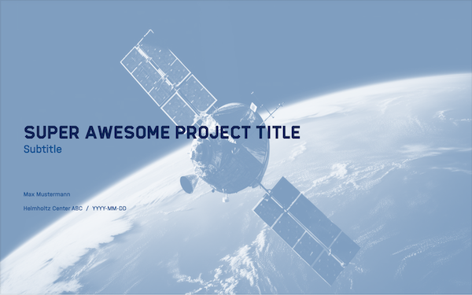
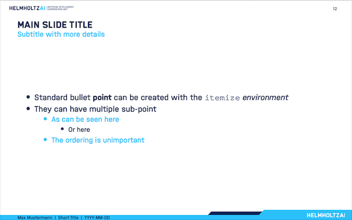
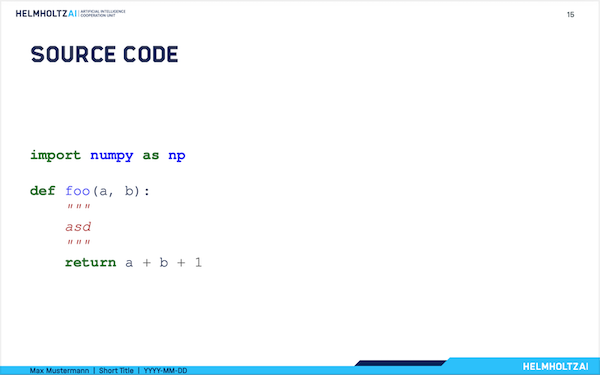
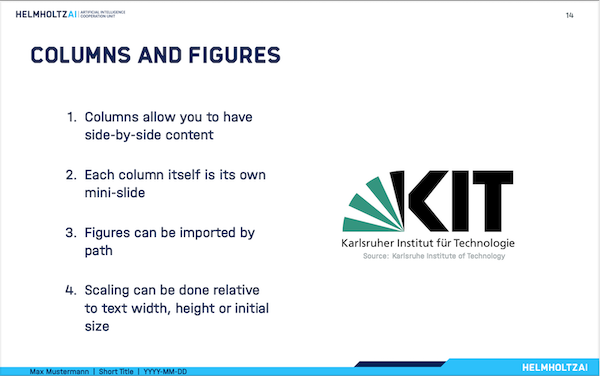
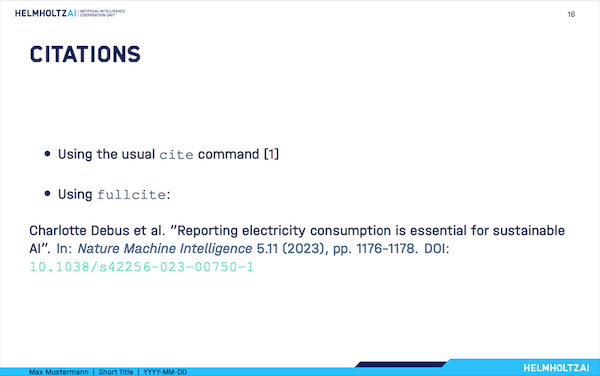
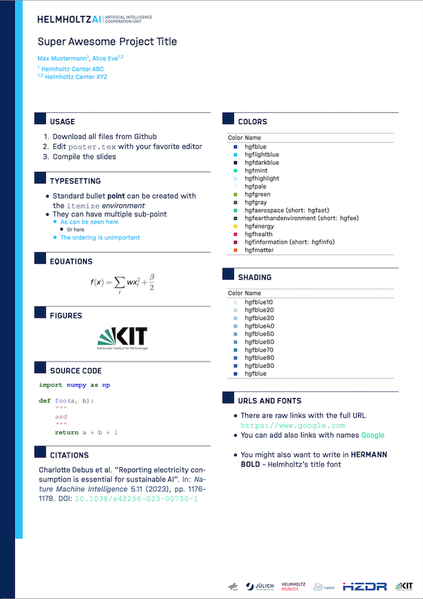

# Helmholtz AI 2024 beamer template

## Status

[](https://opensource.org/licenses/MIT)

## Examples

The template offers a multitude of different slide templates. Below is an incomplete set of example screenshots of the final result.

Complete Examples of the final PDFs can be found on the [releases page](https://github.com/Helmholtz-AI-Energy/beamer-template-2024/releases).

### Title slides

There are title slides for each research field available. Here are two examples (default title and aeronautics, space and transport title):




### Content slides










### Poster



## Requirements

Ensure that you have an up-to-date LaTeX distribution installed on your system.

*Ubuntu/Debian*

```sh
$ sudo apt install texlive-full
```

*Fedora/CentOS/RHEL*

```sh
$ sudo dnf install texlive-scheme-full
```

*TeX Live (any system)*

If you don't have sudo access you can install [TeX Live](https://www.tug.org/texlive/) locally.
Visit the [TeX Live quick install page](https://www.tug.org/texlive/quickinstall.html) for instructions.

## Building the slides

In order to build your slides you can build locally or use the GitHub/GitLab CI.

### Local build

Local builds use your favorite LaTeX IDE, like TeXstudio, Texmaker or even Overleaf.
Please ensure that you compile it with XeLaTeX or LuaLaTeX instead of the (usual default) pdfLaTeX.

You can opt to use the provided `Makefile` and simply typing the following in your terminal:

```sh
$ make
```

which uses the `latexmk` tool under the hood. We highly recommend `latexmk` when
compiling on the command line since it handles the bibliography, e.g. using
`bib(la)tex` + `biber` automatically.

To build the poster, use the following command:

```sh
$ make poster
```

To get rid of all the temporary files created during the compilation, use

```sh
$ make clean
```

To also remove final slides PDF use

```sh
$ make allclean
```

Alternatively, you can use the `latexmk` tool directly to compile your slides (either in the terminal or by setting it as the compiler in your IDE).
A working `.latexmkrc` is included.

```sh
$ latexmk slides.tex
```

To get rid of all temporary files created during compilation use the `-c` flag (`-C` to also remove the final slides PDF):

```sh
$ latexmk -c
```

Note: At the time of writing, the contents of this repo can be readily used on [overleaf](https://overleaf.com).

### Build using the GitHub/GitLab CI

The latest versions of the PDFs can be created by simply adding a tag:

```sh
$ git tag v0.2.0
$ git push origin --tags
```

After a couple of minutes (~3 min) the new PDFs will appear on the [releases page](https://github.com/Helmholtz-AI-Energy/beamer-template-2024/releases).

### Example PDF files

A new release (including the latest versions of the PDFs) can be created by simply adding a tag:

```sh
$ git tag v0.2.0
$ git push origin --tags
```


## License

The Helmholtz AI beamer template is distributed under the MIT license, see our [LICENSE](LICENSE) file for details.

## Copyrights

The images and fonts provided as part of this LaTeX source code repository are copyrighted. As member of the Helmholtz Association you can freely use the material. For Helmholtz AI external users, you have to ensure that you are allowed to use a) the Helmholtz AI visual material, b) the Helmholtz corporate design as well as c) the Hermann Bold font as well as the Halvar and Corporate-S font families.

-----------
<div align="center">
  <a href="https://www.helmholtz.ai/"></a>
</div>

